<div align="center">

# ⚡ ZERANT

### AI-Powered Mobile Browser Agent

*Browse the web with natural language commands*

[](https://reactnative.dev/)
[](https://expo.dev/)
[](https://www.typescriptlang.org/)
[](LICENSE)

[Features](#-features) • [Quick Start](#-quick-start) • [Architecture](#-architecture) • [Demo](#-demo-tasks)

</div>

---

## ✨ Features

| Mode | Description |
|------|-------------|
| 🌐 **Browser Mode** | Traditional web browsing with search |
| 🤖 **Agent Mode** | Natural language commands + AI automation |

### Agent Actions
- **Click** - Click elements by selector or text
- **Fill** - Enter text in form fields
- **Navigate** - Go to URLs
- **Extract** - Pull data from pages
- **Scroll** - Scroll for more content
- **Observe** - Discover page elements

## 🚀 Quick Start

```bash
# Clone and install
cd zerant-browser
npm install

# Start Expo
npx expo start

# Run on device
# Press 'i' for iOS | 'a' for Android
```

## 🔑 API Keys

Create a `.env` file with at least ONE provider:

```env
# Choose one or more providers:

# Claude (Anthropic) - Recommended
ANTHROPIC_API_KEY=sk-ant-your-key

# OpenRouter - Access to 100+ models
OPENROUTER_API_KEY=sk-or-your-key

# OpenAI - GPT-4o, GPT-4-turbo
OPENAI_API_KEY=sk-your-key

# Gemini (Google)
GEMINI_API_KEY=your-key
```

Get your keys:
- **Claude**: https://console.anthropic.com
- **OpenRouter**: https://openrouter.ai/keys
- **OpenAI**: https://platform.openai.com/api-keys
- **Gemini**: https://ai.google.dev

## 📱 Usage

### Browser Mode
1. Type search query or URL
2. Press search button
3. Browse normally

### Agent Mode
1. Toggle to 🤖 Agent Mode
2. Type command: *"Find the cheapest flight to Bangalore"*
3. Press 🚀 to execute
4. Watch AI navigate and extract data

## 🏗 Architecture

```mermaid
graph TB
    subgraph "📱 ZERANT Browser"
        UI[🎨 UI Layer]
        Agent[🤖 AI Agent Layer]
        Browser[🌐 Browser Engine]
        Storage[💾 Storage]
        
        UI -->|User Commands| Agent
        Agent -->|Execute Actions| Browser
        Browser -->|DOM Data| Agent
        Agent -->|Results| UI
        Storage -.->|API Keys| Agent
        
        subgraph "UI Components"
            Header[Header.tsx]
            Control[ControlBar.tsx]
            WebView[BrowserView.tsx]
            Log[ActionLog.tsx]
        end
        
        subgraph "AI Providers"
            Claude[Claude 3.5]
            GPT[GPT-4o]
            Gemini[Gemini 2.0]
            Router[OpenRouter]
        end
        
        subgraph "Browser Core"
            JSInject[JS Injection]
            DOMQuery[DOM Parser]
            Navigator[Navigation]
        end
    end
    
    User[👤 User] -->|Natural Language| UI
    Agent -.->|API| Claude
    Agent -.->|API| GPT
    Agent -.->|API| Gemini
    Agent -.->|API| Router
    
    style UI fill:#61dafb,stroke:#333,stroke-width:2px
    style Agent fill:#ff6b6b,stroke:#333,stroke-width:2px
    style Browser fill:#4ecdc4,stroke:#333,stroke-width:2px
    style Storage fill:#ffe66d,stroke:#333,stroke-width:2px
```



## 🔄 How It Works

```mermaid
sequenceDiagram
    participant User as 👤 User
    participant UI as 🎨 UI
    participant AI as 🤖 Agent
    participant Web as 🌍 Web

    User->>UI: "Find flights to Tokyo"
    UI->>AI: Parse Command
    AI->>AI: Select AI Provider
    AI->>Web: Navigate & Search
    Web-->>AI: Page HTML
    AI->>Web: Execute Actions
    Web-->>AI: Extract Data
    AI->>UI: Format Results
    UI->>User: Display
```



## 🛠 Tech Stack

### Core Technologies
| Technology | Version | Purpose |
|------------|---------|---------|
| **React Native** | 0.81.5 | Cross-platform mobile |
| **Expo** | 54.0 | Dev platform |
| **TypeScript** | 5.9.2 | Type safety |
| **WebView** | 13.16.0 | Browser engine |

### AI Provider Priority

```mermaid
graph LR
    Start([Request]) --> OpenRouter{OpenRouter?}
    OpenRouter -->|✅| Execute[Execute Task]
    OpenRouter -->|❌| Claude{Claude?}
    Claude -->|✅| Execute
    Claude -->|❌| GPT{GPT-4o?}
    GPT -->|✅| Execute
    GPT -->|❌| Gemini{Gemini?}
    Gemini -->|✅| Execute
    Gemini -->|❌| Error[❌ No Provider]
    
    style Execute fill:#4ecdc4,stroke:#333,stroke-width:2px
    style Error fill:#ff6b6b,stroke:#333,stroke-width:2px
```



**Priority Order:**
1. 🌐 **OpenRouter** - 100+ models
2. 🧠 **Claude 3.5** - Most capable
3. 🤖 **GPT-4o** - Versatile
4. ✨ **Gemini 2.0** - Fast

## 📁 Project Structure

```mermaid
graph TD
    Root[📦 zerant-browser]
    Root --> App[App.tsx]
    Root --> Src[src/]
    Root --> Assets[assets/]
    Root --> Config[⚙️ config files]
    
    Src --> Comp[components/]
    Src --> Agents[agents/]
    Src --> Browser[browser/]
    Src --> Types[types/]
    Src --> Utils[utils/]
    
    Comp --> C1[Header.tsx]
    Comp --> C2[ControlBar.tsx]
    Comp --> C3[BrowserView.tsx]
    Comp --> C4[ActionLog.tsx]
    
    Agents --> A1[ClaudeAgent.ts]
    Agents --> A2[GeminiAgent.ts]
    Agents --> A3[OpenAIAgent.ts]
    Agents --> A4[OpenRouterAgent.ts]
    
    Browser --> B1[InjectedAgent.ts]
    
    style Root fill:#ff6b6b,stroke:#333,stroke-width:3px
    style Src fill:#4ecdc4,stroke:#333,stroke-width:2px
    style Comp fill:#61dafb,stroke:#333,stroke-width:2px
    style Agents fill:#ff6b6b,stroke:#333,stroke-width:2px
```



## 🎯 Demo Tasks

```mermaid
mindmap
  root((🤖 Try These))
    Search
      Weather in Tokyo
      News about AI
      Flights to NYC
    Navigate
      Go to GitHub
      Open HackerNews
      Visit ProductHunt
    Interact
      Click first link
      Fill search box
      Scroll down
    Extract
      Get all links
      Pull headlines
      Extract prices
```



---

<div align="center">

### 🌟 Built with ❤️ for the future of browsing

*Inspired by [Perplexity Comet](https://www.perplexity.ai/) • [BrowserOS](https://browser.os) • [Stagehand](https://github.com/browserbase/stagehand)*

### 📝 License

MIT License - Open Source

---

**Made by developers who believe in AI-powered automation** 🚀

</div>
